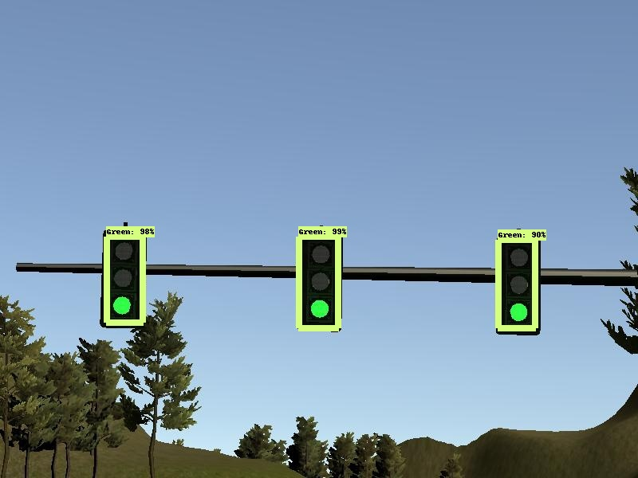
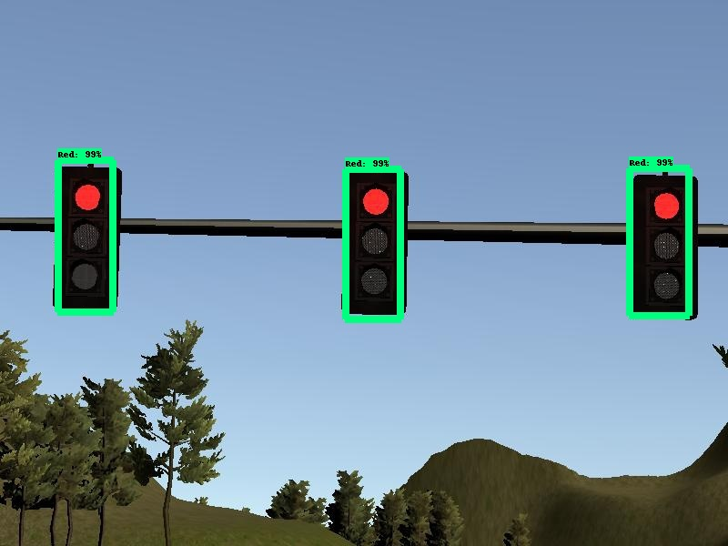
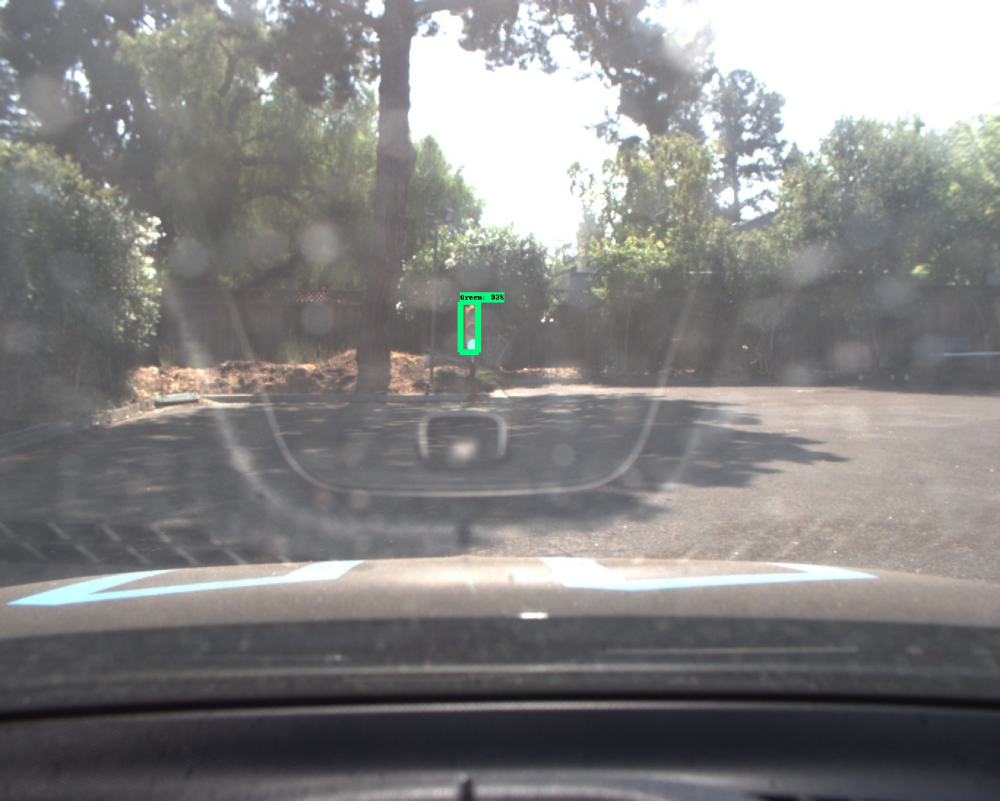
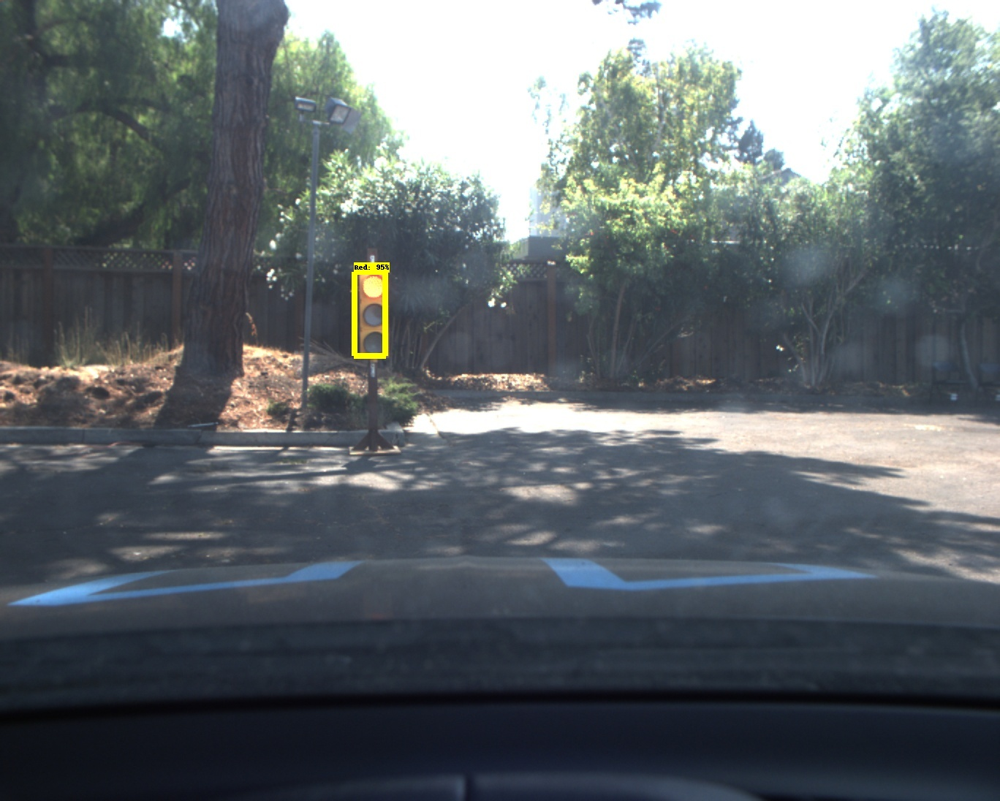

### CapStone Project

This project is coordinated under following hardware/software circumstances.

1. Ubuntu 16.04 TLS (xenial)
2. Linux machine X99 processor (16GB MEM 250GB SSD) 
3. NVIDIA GTX1080Ti GPU processor (used for real-time traffic light classification)
4. ROS Kinetic
5. tensorflow 1.4.0
6. tensorflow model library (used for objected detection pretrained model classfication)
7. ssd_mobilenet_v1_coco_2017_11_17/ssd_inception_v2_2017_11_17
8. python 2.7

## 1. Waypoints updater 
As first approach to build projected lane, we need to publish a fixed number of waypoints ahead of simlation car running on the rounding street.

* Object is to find closest waypoint

##### Parameters
* LOOKAHEAD = 200
* PROGRAM FREQUENCY = 30HZ

>Initially we started the program with PROGRAM FREQUENCY 50HZ dettaching the camera view mode, however simulation vehicle starts to maze running on the projected trajectry road once switching on the camera. By numerous try and error to run the program, we have choosed the program cycle with 30HZ. 

>A program first of all needs to subscribe the topic __/base_waypoints__ to be followed by the simulation car. /base_waypoints is Lane object, that has several significant numerical components (eg. wapoints array owning pose.pose x and y value). This data point is readable with one time flash when the simulation program started. Also, this data is exactly same as data/sim_waypoints.csv, which is readable data points with this program. 

>Secondly, the program (get_closest_point_id function) reads the memorable waypoints __(waypoints_2d)__  to calculate most closest points with 2D Euclidean distance function to the current car position (__self.pose.pose.x/y__ is retrieved with *pose_cb* when subscribing current_pose topic.). This one time list is used to calculate the clsoset points of the simlating car. Addition to calculating the closest points, program has to determine whether car is behind the closest point, once car is ahead of closest point, we increments closest index +1 to show the accurate data points. 
Also, its process is called every 30HZ, which could be right timing to find the tracking lane for the car. Once we set 50HZ, the car starts to run out the projected lane data points.

* Construct final waypoints
>Then publish final waypoints which are the number of look ahead (__LOOKAHEAD__ parameter) waypoints starting at the calculated next waypoint in the above mentioned process.
The speeds at published waypoints are set to the lower of target speed and maximum speed of the particular waypoint

* Calculate trajectory
>The target speed at the next waypoint is calculated as the expected speed (velocity) at the next waypoint.
Generally, speed is decreased upto next traffic light (= __stopline_wp_idx__ retrieved with *traffic_cb* ) point.
If there is no traffic light stopline, then target speed is set to the maximum speed limit.

* Braking point detection
>Braking point is calculated following logic. Once braking distance is found between min/max braking points, program sets DECELERATION flag so that it starts to decelerate velocity and make short waypoints for running simulating car.    
```  
dl = lambda a, b: math.sqrt((a.x-b.x)**2 + (a.y-b.y)**2  + (a.z-b.z)**2)
brake_distance = dl(start_car_position, trafficlight_position) - SAFETY_BUFFER

min_brake_distance = 0.5 * self.current_velocity_in_mps ** 2 / self.deceleration_limit_max_in_mps
max_brake_distance = 0.5 * self.current_velocity_in_mps ** 2 / self.deceleration_limit_min_in_mps
```

## 2. DBW (Drive By Wire)
>DBW is shorten mnemonic name standing on Drive by Wire process, which has central controller (system hub) to bridge software and hardware data process. It gives smooth operation to take action on the physical devices like steering, pedaling and braking etc. Hereby this time our project focus on these 3 top controllers handling, throtling and decelating the car speed. 
The acceleration is controlled via PID controller. Steering is calculated using YawController which simply calculates needed angle to keep needed velocity.

dbw_node.py / pid.py / thwist_controller.py are implemented. 

## 3. Traffic Classification
Of the numeraous approaches to find the traffic signal color identifcation, we have selected ssd_inception model from Zoo model libray, which provides the pretrained model library (*ssd_inception_v2_coco_2017_11_17*). The model is trained with 10,000 steps, so that finally extracted the packed libray __sim_frozen_inference_graph.pb__ for simulated traffic image and __real_frozen_inference_graph.ph__ for real udacity traffic image. 
https://github.com/tensorflow/models/blob/master/research/object_detection/g3doc/detection_model_zoo.md 
__A part of tensorflow model library ObjectDetection__ is used to re-train our extracted signal image from simlation and udacity real driving image.
https://github.com/tensorflow/models/tree/master/research

tl_detect.py / tl_classifier.py are implemented.

The log message is displayed when prgram started every time detection program identify which traffic signal color are seen at the far point from the camera of running car. Detection performance of the color identification is around 0.02 / 0.03s. Also the model gives us the remarkable probability confidence to judge the right color of the traffic signal.     

>[INFO] [1541316477.480786]: Traffic Light. Current State: GREEN
Classification..
0.025146
('SCORES: ', 0.90331835)
('CLASSES: ', 1)
GREEN

#### Classified Result Image (offline test by ssd frozen model)
Green on Simulation

Red on Simulation


Green on RealImage

Red on RealImage


*** 

This is the project repo for the final project of the Udacity Self-Driving Car Nanodegree: Programming a Real Self-Driving Car. For more information about the project, see the project introduction [here](https://classroom.udacity.com/nanodegrees/nd013/parts/6047fe34-d93c-4f50-8336-b70ef10cb4b2/modules/e1a23b06-329a-4684-a717-ad476f0d8dff/lessons/462c933d-9f24-42d3-8bdc-a08a5fc866e4/concepts/5ab4b122-83e6-436d-850f-9f4d26627fd9).

Please use **one** of the two installation options, either native **or** docker installation.

### Native Installation

* Be sure that your workstation is running Ubuntu 16.04 Xenial Xerus or Ubuntu 14.04 Trusty Tahir. [Ubuntu downloads can be found here](https://www.ubuntu.com/download/desktop).
* If using a Virtual Machine to install Ubuntu, use the following configuration as minimum:
  * 2 CPU
  * 2 GB system memory
  * 25 GB of free hard drive space

  The Udacity provided virtual machine has ROS and Dataspeed DBW already installed, so you can skip the next two steps if you are using this.

* Follow these instructions to install ROS
  * [ROS Kinetic](http://wiki.ros.org/kinetic/Installation/Ubuntu) if you have Ubuntu 16.04.
  * [ROS Indigo](http://wiki.ros.org/indigo/Installation/Ubuntu) if you have Ubuntu 14.04.
* [Dataspeed DBW](https://bitbucket.org/DataspeedInc/dbw_mkz_ros)
  * Use this option to install the SDK on a workstation that already has ROS installed: [One Line SDK Install (binary)](https://bitbucket.org/DataspeedInc/dbw_mkz_ros/src/81e63fcc335d7b64139d7482017d6a97b405e250/ROS_SETUP.md?fileviewer=file-view-default)
* Download the [Udacity Simulator](https://github.com/udacity/CarND-Capstone/releases).

### Docker Installation
[Install Docker](https://docs.docker.com/engine/installation/)

Build the docker container
```bash
docker build . -t capstone
```

Run the docker file
```bash
docker run -p 4567:4567 -v $PWD:/capstone -v /tmp/log:/root/.ros/ --rm -it capstone
```

### Port Forwarding
To set up port forwarding, please refer to the [instructions from term 2](https://classroom.udacity.com/nanodegrees/nd013/parts/40f38239-66b6-46ec-ae68-03afd8a601c8/modules/0949fca6-b379-42af-a919-ee50aa304e6a/lessons/f758c44c-5e40-4e01-93b5-1a82aa4e044f/concepts/16cf4a78-4fc7-49e1-8621-3450ca938b77)

### Usage

1. Clone the project repository
```bash
git clone https://github.com/udacity/CarND-Capstone.git
```

2. Install python dependencies
```bash
cd CarND-Capstone
pip install -r requirements.txt
```
3. Make and run styx
```bash
cd ros
catkin_make
source devel/setup.sh
roslaunch launch/styx.launch
```
4. Run the simulator

### Real world testing
1. Download [training bag](https://s3-us-west-1.amazonaws.com/udacity-selfdrivingcar/traffic_light_bag_file.zip) that was recorded on the Udacity self-driving car.
2. Unzip the file
```bash
unzip traffic_light_bag_file.zip
```
3. Play the bag file
```bash
rosbag play -l traffic_light_bag_file/traffic_light_training.bag
```
4. Launch your project in site mode
```bash
cd CarND-Capstone/ros
roslaunch launch/site.launch
```
5. Confirm that traffic light detection works on real life images
